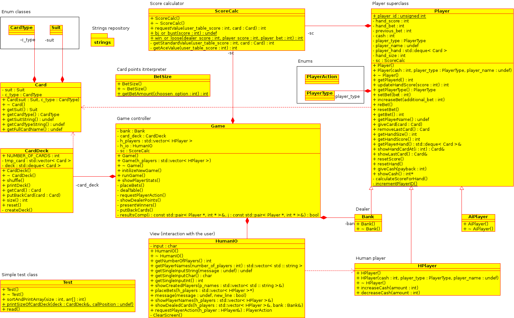

Oblig 1: BlackJack
================================

I oppgaven har jeg valgt å til mesteparten fokusere på objektorientering, strukturer og generell arkitektur til større grad enn å implementere alle tenkbare og valfrie funksjoner. Løsningen har en relativ kompleks struktur for en liten opgave men løsningen er fult skalerbar og hver enkel klasse kan i prisnipp byttes mot en ny og bedre *modul* hvis man så ønsker å uviklere videre på løsningen. 

##Klassehierarki
Klassehierarkien i programmet presenteres grafisk i UML diagrammet neden. Det er til største grad brukt polyformisme, arv og enum typer for klar dataintegritet. Det har varit hensiktsmessig å bruke en MVC struktur i programmet som er fordelt til største delen mellom klasser `Player` (model/business logic), `HumainIO` (view/interaksjon med spiller) og `Game` (controller).

###Enum
Jeg har tatt avgjøreslsen å bruke enum klasser for korttype og suit (ikke enum typer) ettersom klasse gjør dt mulig å implementere eventuelle metoder for hver enum typer. Det er derfor mulig nå å implenetere fesk en metode som gir fra seg en ascii tegn som forestiller feks *SPADES*. Slik funksjonalitet er foreløpig ikke implementeer ennå, enum blir kun brukt for å test type av kort.
* `CardType` Dette er enum classe som innholder objekter for korttype, feks. *King* *Queen* *10* mfl.
* `Suit` Enum type for kortets suit feks. *CLUBS* *SPADES* 
I begge disse enum klasser brukes det statiske arrayer som innholder alle typer (CardType og Suit) for å generere kortstokk med like mange kort som det er definisjoner i enum klassene. 
* `PlayerAction` Enum type som definierer alle user action som både bruker og dealer kan ta i spiller. Dette kan være *BET* *SPLIT* *DOUBLE* *HIT* mm. Denne enum typer er ikke implementert foreløpig. 
* `PlayerType` Enum type som spesifiserer type av spiller som `HPlayer` (human player), `Dealer` og `AIplayer` (AI spiller, ikke implementert ennå). 

###Card
Dette er klasse som brukes i form av datatype for et spillekort. Et spillekort danne gjennom å gi konsturktøren to parametre som er instanser av enum klassen `CardType` og `Suit`. Klasse har deretter getters funksjoner of flere funksjoner som generer `string` utefra kortets enum instans variabler, feks kan `getFullCardName()` generere kort i klartekst som *Ace of Spades*. 

###CardDeck
Klasse implementerer en `deque` av `Card` objekter. Klassens kontruktør danner en kortstokk ved instansiering av objektet. Omstokking gjøres av metoden `shuffle()` hvilken er en egen implementasjon. Kortstokken oprettes gjennnom å populere `deque` av kort gjennom å gjennomløpe alle instanser av kort enums som finnes i respektive klasse for `Suit` og `CardType`. Dette gjør at kortsokken som oprettes er sortert. I funksjonen `shuffle()` lages det først en array med tilfeldige referanser for som alle kortene skal få etter omstokking. Desse blir trukket tilfeldig for alle indekser i stokken som er fra 0 til 52. Dette gjøres gjennom at man trukker et nummer i dette intervallet ok manrkerer denne indeksen i en `bool` array. Algoritmen blir mer innefektiv ju nærmere vi kommer de siste tallene i intervallet (feks hvis vi har kun tre tall igjenn å trekke må vi kjøre random funksjonen i intervallet til vi trekke akkuratt de tall som mangler). Klasse innholder flere getters og andre hjelpefunksjoner som `size()` og `rest`. 

###Player
Dette er programmts største klasse som i sin tur er superklasse til alle typer av spillere som `HPlayer`, `Bank` og `AIPlayer`. Denne klassen er skal være impementasjon av *business logic* i programmet. Klassens funksjoner håndterer all logigg mellom spilleren og programens datastrukturer i form av bruker akctions (*BET*, *HIT*, *STAND* mf) og tildeling av vinster. Klassen innholder også datastruktur for `Card` i form av en `deque` som holder spillerens utdelte kort. Disse blir tatt fra kortstokken gjennom *pass by value* slik at kortene fjernes fra spillets kortstokk da disse blir delt ut eller da *HIT* kalles opp fra brukeren. 

####HumanIO
Subklasse til Player klassen som hådterer de spesifikke funksjoner som hører til menskellig spiller. I dette fall er det funksjoner som har brukerens penger å gjøre som `increaseCash(int cash)` og `decreaseCash(int cash)`. 
####AIPlayer
Klassen skal brukes til AI spiller og er desverre ikke implementert ennå. Tanken var at når man skal starte spiller kan man sende med som parameter antall AI spiller som kan lages i tilleg til vanlige spillere. 
####Bank
Dette er dealer klassen som også benytter seg av samme instansvariabler og funksjoner som superklassen Player tilbyr. Klassen heter `Bank` ettersom av en eller annen anledning fikk ikke lov i kalle en klasse for `Dealer` i Eclipse IDE (mer om dette i avsnittet for utfordringer). 

###BetSize
Dette er klases som har en `static` funksjon `getBetAmount(int choosen_option)`. Det er begrenset i programmer hvilke bet som brukeren kan gjøre. Foreløpig er det lov å bette $10, $20 eller $50 og den funksjonen returnerer riktig verdi avhengig av hva brukeren har valgt (trukket på 1, 2 eller 3 da det blir presentert valg).

###ScoreCalc
Klassen har funksjoner som beregner hva brukeren får for score eller dersom man vinner eller taper. Funksjoner som `int getStandardValue(int table_score, Card card)` returner en int med antall poeng som hver kort gir. Funksjonens tyrke her er å regner ut dersom et ess skal gi 11 eller 1 som score. Normalt er dette opp til brukeren men jeg har valgt å implementere dette som de fleste nettkasiner gjør slik at det blir bestemt automatisk utefra hva som er mest guntig for spilleren. Funksjonen `int win_or_loose(int dealer_score, int player_score, int player_bet)`beregner vinsten for hver spiller utefra poeneg som dealern og spilleren har etter at runden er over.

###HumanIO
Klassen håndterer interaksjon med spiller via terminal. Klassen har typiske funksjoner som sørger for å ta inn data om antall spillere, spillernavn, betting, hit og stand samt utskrift av informasjon og statistikk etter hver deal. Klassen har også funksjon `message(std::string mesage, bool new_line)` som brukes for å vise meldinger til brukeren direkte fra kontroller klassene. 

###Strings
Klassen består av flere statiske string konstanter som kan brukes over hele programmet til å rask hente inn standariserte meldinger til brukeren. En slik sentral repository med strenger gjør det mulig å enekelt tilpasse det som blir skrevet ut til bruker uten å endre koden i selve controller klassene.

###Test
Brukes til diverse testing. For det meste var det testing av `deque` og `vector` for å verifisere roktig funksjonalitet av disse klasser. 

###Game
Dette er i prisnipp kontroller klassen sko knyter alt sammen en en enhet. Klassen sørger for å instnserer de riktige klassen og kjøre spillet om igjen det antall ganger som spillene ønsker å gjøre det. Klassen har også funksjoner for å vise statisktikk av resultat etter hver runde av spillet. 

##Læring, utbytte og utfordringer.
Før dette kurset har jeg i prinipp kun programmert i Java. Derfor tenkte jeg å ha en kort oppsumering over det utbytte jeg har hatt fra denne olbligen som kan direkte refere til nyvunne kunskaper i C++. 
* **Parameteroverføring** Hadde egentlig som mål å løse den obligen som man pleier å gjøre i Java dvs "pass by value" men ettersom i C++ pass by value er ren kopiering av data begynte det klarne mer og mer hvorfor man skal benytte seg av referanser. Hvis jeg feks skal lese ut noe fra en datastruktur er det ingen anledning til hvorfor man askall benytte seg av "pass by value". Man ser på mina siste commits at mo sluttet kom det fler og fler funksjoner som benytter seg av referanse og pekere som returverdier eller parametre. Har foreløpig ikke bemestret denne teknikken ennå, skjønner ikke helt hvordan man skal benytte seg fult ut av feks pekere men det er sikkert noe som klarner til til Oblig 2. 
* **Arv og polymorfi** Dette har vært den største utfrodringen i hele oppgaven. Har hatt store problemer med konstruktørene i subklassene. Det har vært ganske utydlig på hvordan de forksjellige kontruktørene skal brukes. Skal instansvarabler i klassene sette i kontruktør koden på innsiden av .h filer eller skal disse gjøres inne i .cpp filene? Noen ganger måtte jeg bruke i tilleg én tom kontruktør for å få lov å kompilere i Eclipse. I grove trekk har jeg bruk én arbeidsdag på å fikse feil som var leratert til problemene med konstruktørene, særlig inne i subklassene til `Player` klassen. 
* **IO** I klassen `HumanIO` finnes det flere hjelpemetoder som leser data tilbake fra bruker input og leverer den tilbake i form av `string`, `char` og `int` avhengig av hvilken datatype som trengs tilbake. Det er brukt flere metoder å lese inn data som feks `redline()`, `cin` mf.
* **Datastrukturer** Det er i stor utstrekking brukt tre datastrukturer: (1) `deque`, (2) `vector` og (3) `pair`. `pair` er egentlig ikke datastruktur men den brukes sammen med `vector` med hensikt å legge inn nøkkel og verdi inne i vektor for å ungå å bruke `map`. Dette gjøres fordi at datastrukturen `map` (*det er mulig at jeg kan ha feil her* ) ikke lar sortere verdiene på nøkkelverdi. Her har jeg ønsket å ha mulighet å sortere på begge sider av `pair` structen. Slik løsning brukes feks da man skal avgjøre hvilken av spillerne som har vunnet runden. Dette da gjøres enkelt gjennom å kalle sortere spillene etter hvem som hadde høyest score i runden gjennom å bruke par av spiller peker og poengsum fra runden gjennom: `vector<pair<Player*, int>> results`. Dette kan man da sortere gjennom å bruke `sort()` og egen komparator avhengig dersom man ønsker å stortere på nøkkel eller veridi.i
* **Makefile** Jeg har store utfordinger med `make`. Den aktuelle `Makefile` er testet og har vært brukt på begge løsningene med fremgang. Dessverre uten å ha gjort noen endringer i filen kommando `make` resulterer nå i: `make: Nothing to be done for 'all'.`. Har foreløpig ikke noe svar på hvorfor dette intreffer. Som plan B er det også vedlagt en shellscript som gjør i prinsipp samme jobb som `make`, denne finne i `./blackjack/src/cmopilerer.sh`.

##Mangler og mulige forbedringer
Det finnes flere ting i spillet som ikke ble gjort ferdig. Blandt disse er: 
* **Ingen feilkontroll** Dersom brukeren presenteres med flere valg feks da man skal legge inn nye bet går det fintå legge inn andre verdier enn det som blir presentert til brukeren. Det borde også legges inn noe type av kontroll med regex eller liknende da brukeren skal skrive inn navnet sitt.
* **Begrensninger i brukeritteraksjon** Det er begrenset for hva brukere får legge inn som bet. Det er ikke heller mulig å starte spellet med ønsket pengebeløp uten startbeløpet for hver spiller er begrenset til $500. Det borde være mulig å starte spillet i et mer avansert modus slik at de spiller som ønsker det kan sette sine enge beløpsnivåer og hvor store beløp som de ønsker å ta med seg til bordet. I samband med dette finnes det to kritiske momenter som kan gjøre at programme krasjær, disse er da spilleren skal velge *BET*, da man har kun tre valg og man velger trykke feks på 4 hvilket er er ugyldig valg. Dette vil da gjøre at switch case kotroll som styrer dette vil gå til sit default valg. Når spilleren skal også velge antall spillere, det kontrolleres ikke at det blir skrevet inn et tall.
* **Dynamisk antall spillere** Det er ikke satt opp noen begrensning for antall spillere. I prinsipp (ikke testet) er det mulig å starte et spill med 100 eller flere spiller ved et å samme bord. Det er ikke heler mulig for en spillere å gå fra bordet. Eneste måten for noen å avlutte spillet er å avlutte hele spillet for alle eksisterende spillere.
* **Ingen håndtereing av exceptions** Even om dette ikke var et krav for oppgaven finnes det ingen håndtering av noen for av exception. Dette borde egentligen bli implementert i samband med alle former av brukerinteraksjon som skjer med spillerne via terminal.
* **Dårlig bruk av `delete`** Det er kun på en plass der det skapes et nytt objekt med hjelp av `new` og det er selve objektet `Game` (det er *controller* for spillet). Det blir heller ikke kalt `delete` på dette objektet ettersom det er ikke lagt inn noen form av sikkelig avsluttningskontroll. Programmet blir nå avluttet etter en ferdig runder hvis en spiller velger `<q>` hvilket gjør at kjøringen av nye spillerunder blir avsluttet da man hopper ut av while løkken som kaller på alle funksjoner i klassen `Game`. Foreløpig er jeg litt usikker på hvordan dette skal håndteres. En ide var å eventuelt bruke seg av *observer* pattern som ser etter dersom brukeren har valg å avslutte programmen og utefra denne kalle opp `delete` for å avslutte programmkjøringen.
* **Flere funksjoner** Jeg har fokusert mer på selve klasse arkitekturen enn på å implementere flere funksjoner. Som viderutvikling hadde jeg hellre nå behålt den eksisterende implementeasjonen og isteden for det bygget videre på å implementere flere funksjoner. 
* **Patterns** Jeg har forsøkt å bruke en enkel *MVC* pattern. I begynnelsen lagde jeg ganske mange feil i koden hvilket medfører at det kan finnes noen "hack" som gjør at implementasjonen av *MVC* er ikke helt til 100%. Dette gjelder i prinsipp `HumanIO` og `Player` klassene som begge i noen av funksjonene kommuniserer utenfor sit ansvarsområde. Det er fult mulig å i større grad å implementere noen design pattern som kan i bedre grad forbedre informasjonsutbytte mellom de forskejllige klassene.
* **Brukerinteraksjon** Som en eventuell videreutvikling borde man eventuelt separere klassen `HumanIO` til flere underklasse og noen hjelpeklasser. Dette kan feks være kun en klasse som leser inn data fra brukeren. Deretter en klasse som tester med `regex` på brukerinput. Samt en egen klasse som kun skriver ut meldinger til brukeren. Dette kan da sys sammen i en overliggende klasse som kommunicerer i form av en IO kontroller videre til `Game`.
