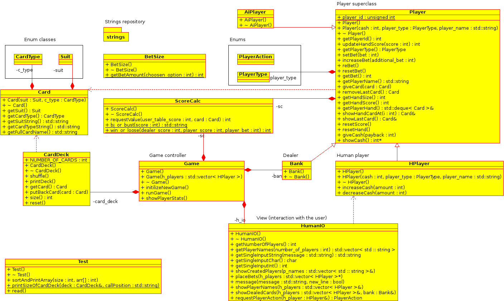

Oblig 1: BlackJack
================================
##Klassehierarki
Klassehierarkien i programmet presenteres grafisk i UML diagrammet neden. Det er til største grad brukt polyformisme, arv og enum typer for klar dataintegritet. 

###Klasser og datatyper
Tester å skrive noe her
